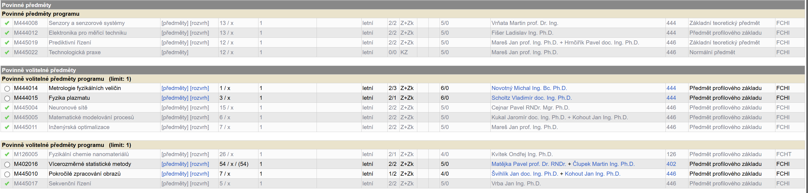

# Aestus – Monitor hladiny vody

Projekt **Aestus** slouží k měření hladiny vody pomocí desky **Wemos S2 mini** (ESP32-S2). Měření probíhá skrze kapacitní vstup (touch pin) a data se ukládají do [Firebase Realtime Database](https://firebase.google.com/). Webové rozhraní (HTML/JS) umožňuje zobrazovat historii měření, vypočítat rozdíl objemu (vypito vs. doplněno) a také sumarizovat celkové množství vypité vody za den.

## Obsah
1. [Hardware](#hardware)  
2. [Zapojení](#zapojení)  
3. [Příprava prostředí (Arduino IDE)](#příprava-prostředí-arduino-ide)  
4. [Instalace knihoven](#instalace-knihoven)  
5. [Nastavení Wi-Fi a Firebase](#nastavení-wi-fi-a-firebase)  
6. [Popis kódu Aestus.ino](#popis-kódu-aestusino)  
7. [Webové rozhraní](#webové-rozhraní)  
8. [Spuštění projektu](#spuštění-projektu)  
9. [Galerie / Obrázky](#galerie--obrázky)  
10. [Licence](#licence)

---

## Hardware

- **Wemos S2 mini (ESP32-S2)**: Nízkopříkonová vývojová deska na bázi ESP32-S2, vybavená USB rozhraním a možností touch pinů.
- **Tlačítko** pro probuzení: Připojeno na GPIO 16.
- **LED** pro indikaci měření: Připojena na GPIO 15.
- **Snímací elektroda** (kapacitní senzor) na **touch pin** T11 (fyzický pin se liší dle desky).  
- **Zdroj napájení**: 5V přes USB (nebo jiný, dle potřeby).

---

## Zapojení

1. **LED**  
   - Katoda (kratší nožička) → GND  
   - Anoda (delší nožička) → GPIO 15 (sériový rezistor 220–330 Ω)
2. **Tlačítko**  
   - Jeden pin tlačítka → GPIO 16  
   - Druhý pin tlačítka → GND  
   - Firmware používá `INPUT_PULLUP`, takže v klidu je pin HIGH, při stisku LOW.
3. **Kapacitní senzor**  
   - Připojen na pin T11 (touch pad).  
   - Může to být kovová ploška či drátek.
4. **Napájení**  
   - Většinou stačí napájení přes microUSB / USB-C na Wemos S2 mini.

---

## Příprava prostředí (Arduino IDE)

1. **Nainstalujte Arduino IDE** (1.8+ nebo 2.0+).  
2. V **Preferences** přidejte do `Additional Board Manager URLs`:
https://raw.githubusercontent.com/espressif/arduino-esp32/gh-pages/package_esp32_index.json
3. V **Board Manager** (Nástroje → Správce desek) vyhledejte `esp32` a nainstalujte balíček od Espressif Systems.  
4. V **Tools → Board** vyberte `ESP32S2 Dev Module` nebo `Wemos S2 mini` (pokud je k dispozici).

---

## Instalace knihoven

Projekt používá:

- [**Firebase_ESP_Client**](https://github.com/mobizt/Firebase-ESP-Client)  
- **WiFi** (součástí ESP32 Arduino Core)  
- **time.h** (také součástí ESP32 Arduino Core)

### Postup:
1. Stáhněte ZIP knihovny [Firebase-ESP-Client](https://github.com/mobizt/Firebase-ESP-Client).
2. V Arduino IDE: **Sketch → Include Library → Add .ZIP Library...** a vyberte stažený soubor.
3. Případně použijte Library Manager, je-li k dispozici.

---

## Nastavení Wi-Fi a Firebase

V souboru **Aestus.ino** na začátku doplňte:

```cpp
const char* ssid = "NazevVasiSite";
const char* password = "HesloKSite

#define FIREBASE_HOST "https://xxx-xxxxx-default-rtdb.europe-west1.firebasedatabase.app/"
#define FIREBASE_AUTH "xxxxxxxxxxxxxxxxxxxxxxxxxxxx"
```
**ssid, password: Váš název a heslo Wi-Fi.**
FIREBASE_HOST: URL Realtime Database z Firebase konzole.
FIREBASE_AUTH: Váš klíč/token.
Poznámka: Pro vyšší bezpečnost lze citlivá data (Wi-Fi, tokeny) přesunout do souboru Secrets.h a ten nezařadit do repozitáře pomocí .gitignore.

## Popis kódu Aestus.ino
Includy
```
cpp
Copy
Edit
#include <esp_sleep.h>
#include <WiFi.h>
#include <Firebase_ESP_Client.h>
#include <time.h>
```
Zajišťují Wi-Fi, práci s Firebase a režimem spánku.

## Globální proměnné

BUTTON_PIN = 16, LED_PIN = 15, touchPin = T11.
FIFO buffer fifoBuffer[], index fifoIndex k ukládání měření offline.
Časové konstanty gmtOffset_sec, daylightOffset_sec pro ČR.
setup()

Nastaví piny (tlačítko, LED).
Inicializuje Firebase (nastaví config.host, config.signer.tokens.legacy_token).
Umožní probuzení pomocí esp_sleep_enable_ext0_wakeup(...).
Zavolá esp_light_sleep_start().
loop()

Rozpozná důvod probuzení (esp_sleep_get_wakeup_cause()).
Provede měření hladiny (10× touchRead(touchPin) → výpočet průměru).
Připojí se k Wi-Fi s timeoutem 30s.
Nastaví NTP čas (configTime(...)).
Spočítá aktuální epoch čas (pokud je Wi-Fi nedostupné, dopočítá z předchozího času).
Vytvoří JSON a buď ho odešle do Firebase, nebo uloží do FIFO, když není internet.
esp_light_sleep_start() opět uspí desku.

## Webové rozhraní

V repozitáři se nachází index.html s JavaScriptem (Firebase SDK).
Připojí se k téže databázi (databaseURL, klíče) a čte cestu /water_level_logs.
Zobrazuje tabulky:
Čas záznamu, hodnota senzoru, objem.
Delta objem (jen při pití).
Celkový objem vypitý za den.
Spustíte jej v prohlížeči nebo na lokálním serveru (např. Live Server ve VSCode).

## Spuštění projektu
Zkompilujte a nahrajte Aestus.ino do Wemos S2 mini (zvolte správnou desku v Arduino IDE).
Po startu se deska uspí. Probuzení nastane stiskem tlačítka na GPIO 16.
ESP provede měření, pokusí se odeslat data do Firebase.
Otevřete Firebase Realtime Database (nebo index.html) pro kontrolu přijatých dat.

## Galerie / Obrázky




Zařízení v akci

Webové rozhraní

## Licence
Projekt Aestus je vyvíjen hlavně pro studijní účely a není aktuálně licencován pod žádnou konkrétní open-source licencí. Pokud kód šíříte či upravujete, mějte na paměti licence knihoven (např. Firebase_ESP_Client) a související předpisy.


